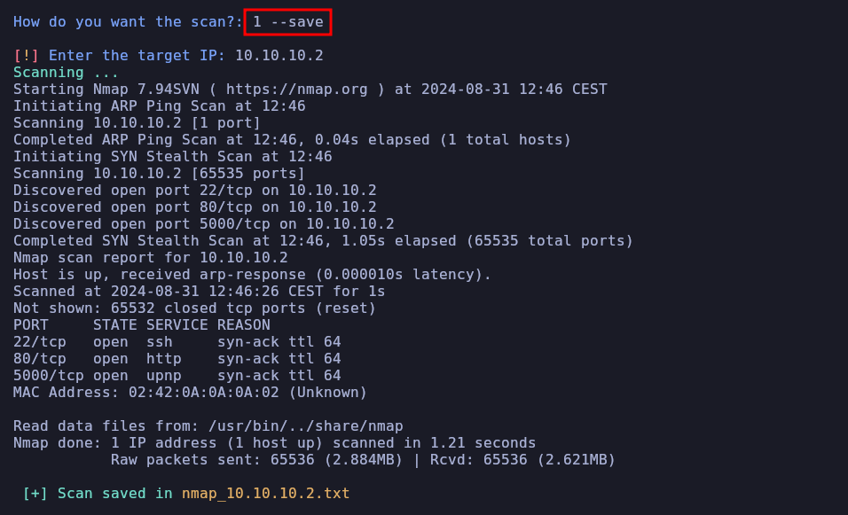
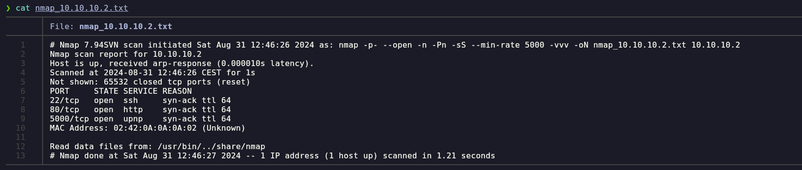
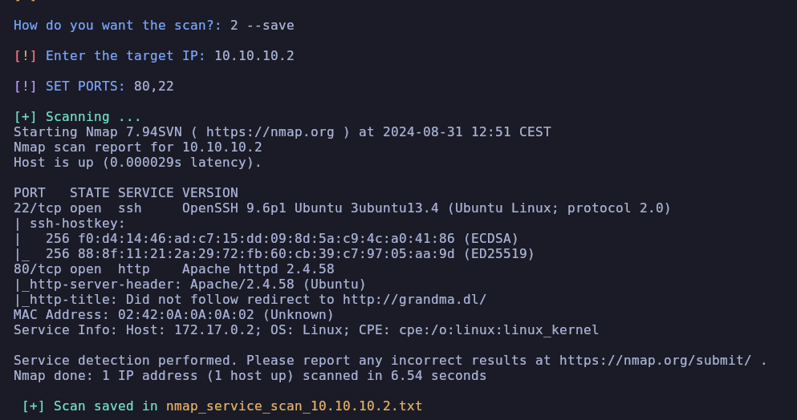
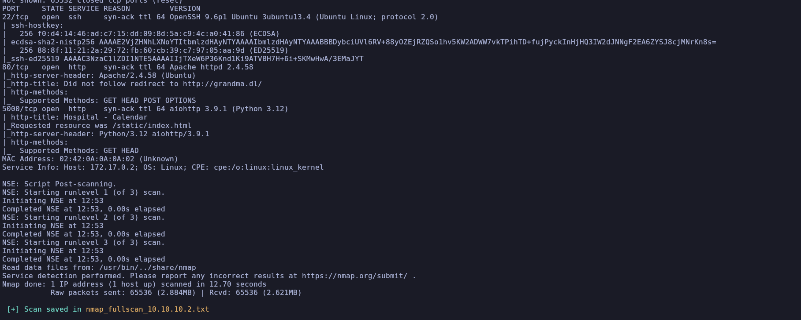

# NetBash 
Netbash is an automated bash tool that will help the user to enumerate systems, where you can do Host Discovery, Port Scanning and much more!!

# Usage
When you run the tool you can see the following:

You have two functional parameters, the only functional tool is **Netscan**.

## NetScan (Tested in  )

If we start netscan as a non-privileged user, it will ask us to be a privileged user:

We will be able to see 6 options, I will show all of them:

### Simple scan

Selecting the first one will ask for the IP of the target:

And it will perform a basic nmap scan but with some parameter optimizations that come with nmap:

and if you want to save the scan to a file:

### Scan services and versions

You can also do a specific scan of ports that you are interested in knowing more about:

### Full Scan
The full scan is a combination of 1 and 2:

